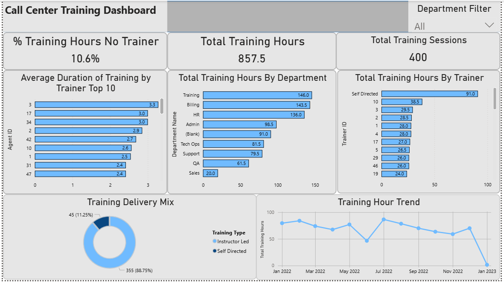

# Call Center Training Performance Dashboard


## Overview

This project analyzes training activity across a call center organization to understand **who is delivering training, how much training is occurring, and where gaps exist**.

Using SQL for data analysis and Power BI for visualization, the dashboard highlights departmental training contribution, session efficiency, and coverage of self-directed training.

This project demonstrates core junior analyst skills in:

* Relational data analysis
* SQL aggregation and joins
* Data modeling in Power BI
* KPI development
* Interactive dashboard design
* Data quality assessment

---

## Business Problem

Call center leadership needs visibility into training delivery to answer questions such as:

* Which departments contribute the most training hours?
* Who are the most active trainers?
* How long are training sessions on average?
* How much training occurs without an assigned trainer?
* Are there departments that are under- or over-represented in training delivery?

The goal is to provide a **clear, interactive view of training performance and coverage**.

---

## Dataset

The analysis uses three relational tables:

* **training_sessions** — session records including duration and assigned trainer
* **agents** — agent roster and department assignment
* **departments** — department reference data

Key relationship path:

```
training_sessions.trainer_agent_id → agents.agent_id → departments.dept_id
```

---

## Tools Used

* **MySQL** — data querying and aggregation
* **Power BI** — data modeling and visualization
* **Power Query** — minor data cleaning
* **DAX** — KPI calculations

---

## Key Metrics

The dashboard tracks:

* Total Training Hours
* Average Session Length
* Training Sessions by Department
* Training Hours by Department
* Self-Directed Training Share
* Training Trend Over Time

---

## Key Insights

* Training delivery is concentrated in specific departments, indicating uneven participation.
* A measurable portion of training hours occurs without an assigned trainer, representing self-directed learning.
* Session lengths are relatively consistent across most trainers, with a few higher-duration outliers.
* Departmental contribution varies significantly, suggesting opportunities to rebalance training ownership.

---

## Data Quality Considerations

During analysis, the following checks were performed:

* Identification of sessions with **NULL trainer assignments**
* Validation of join paths between sessions, agents, and departments
* Handling of missing trainer values for reporting clarity
* Verification that aggregations did not duplicate rows due to joins

---

## Dashboard Features

* Executive KPI cards
* Department performance comparison
* Trainer efficiency analysis
* Self-directed training visibility
* Monthly training trend
* Interactive department slicer

The layout was intentionally designed for **executive readability within five seconds**.

---

## What This Project Demonstrates

This project shows the ability to:

* Translate business questions into analytical queries
* Build correct SQL joins across related tables
* Create meaningful KPIs in DAX
* Design clean, readable Power BI dashboards
* Perform basic data quality validation
* Communicate insights clearly

---


## Author

Reid Grossen
Aspiring Data Analyst

---
